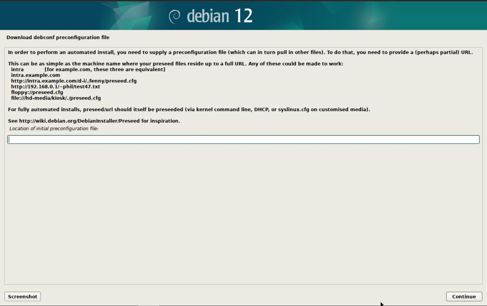
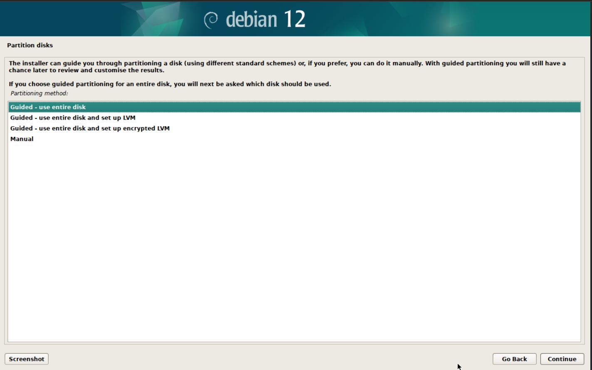
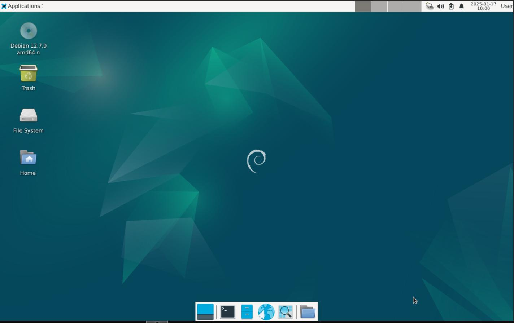
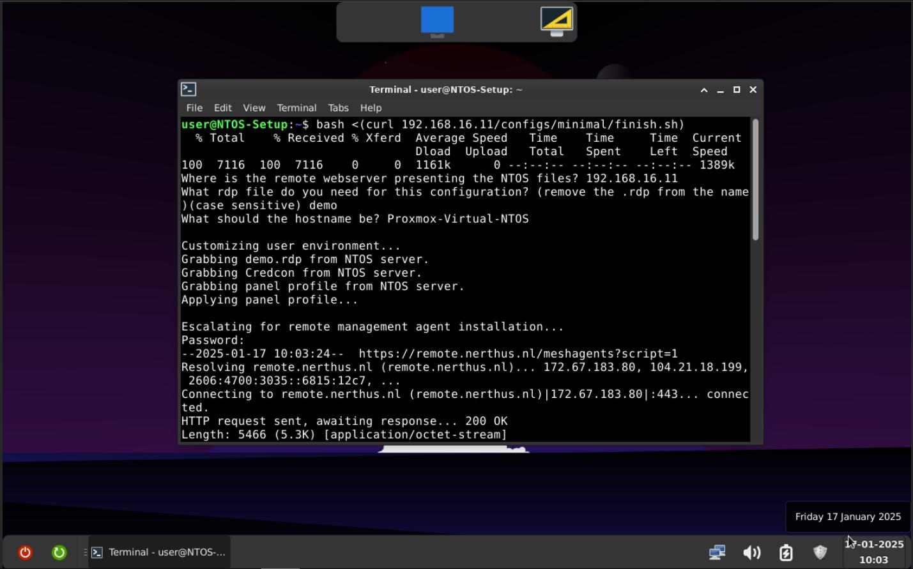

> [!NOTE]
> *If you experience issues or have suggestions, submit an issue! https://github.com/DaanSelen/ntos/issues I'll respond ASAP!*

# Glossary (README.md)

Nerthus Thin Operating System (NTOS).<br>
What is it? What problem does it solve?<br>
NTOS tries to solve the problem where enterprise-grade ThinClient operating systems cost a lot of money for relatively less features (in my opinion).<br>

This is where NTOS comes in: - it is based on Debian for stability and security - it can run on as small of a harddrive as 4GB with 2GB RAM (tested) - and it is very minimal.<br>
It (NTOS) specifically uses a Debian installation with a customized Desktop Environment (DE) (XFCE4) to minimize the points of "trouble" a user can cause.<br>

It offers a way to connect to cloud environments (currently only RDP-based) in a easy and straight-to-the-point method using the Credcon (Bash script) 😁.<br>

I added ways to set-up a server for installation (perhaps I can add PXE in the future). And a guide to get started! Feel free to open an issue or email me.

## How to Install:

The following section explains how to apply this.<br>
I also made a YouTube video [here](https://www.youtube.com/watch?v=IZEBjlq8x00):

### Prerequisites:
- A configured remote management system, such as MeshCentral (the installation of such a system is beyond the scope of NTOS).<br>
Such a remote management system often provides a way to install an agent. To incorporate this into the NTOS installation do:<br>
Paste your installation commands into the root part, for example: `./configs/minimal/finish.sh at line 74 to 76`.

    > If you do not configure a remote management system, then your system will be hard to debug or trouble-shoot (because of the fool-proof nature).<br>
    > Personally I've used MeshCentral which is free and works great! Link is [here](https://github.com/Ylianst/MeshCentral)

- A Debian installation medium, such as an USB-stick with Debian net(work)-inst(allation) or the CD/DVD media flashed onto it. (For flashing see: [rufus](https://rufus.ie/) / [Balena Etcher](https://www.balena.io/etcher))<br>

- Networking connectivity. (DHCP is easiest and fastest)

### How to Setup a Webserver with NTOS-files:

1.  To set everything up, execute the `setup.sh` bash script and answer its questions.<br>
    Once that's done, you can verify that with (configure to your own situation):<br>
    `curl http://localhost/configs/minimal/preseed.cfg`.<br>
    This should output the Debian preseed for the minimal configuration.<br>

# How to Debug?

If you are encountering issues with - most likely connecting the actual RDP session. Follow these steps!<br>
Make sure you have exported the correct DISPLAY environment variable.<br>
The way I do this - is in MeshCentral I enter the `Terminal` tab and enter `export DISPLAY=:0`.<br>

> This makes sure all graphical apps pop-up on the actual monitor!

Then if you want to debug `Credcon` do the following:

```shell
bash ~/Templates/credcon.sh
```

This will print the output to the current terminal, while keeping the GUI/Dialogue boxes on the monitor!

Example output:
```text
user@NTOS:~/Templates$ bash credcon.sh 
Starting loading bar
# 1%
# 2%
# 3%
# 4%
[16:39:02:892] [8315:8327] [ERROR][com.freerdp.core] - freerdp_tcp_connect:freerdp_set_last_error_ex ERRCONNECT_DNS_NAME_NOT_FOUND [0x00020005]
# 5%
[16:39:02:946] [8315:8327] [ERROR][com.freerdp.core] - rdg_establish_data_connection:freerdp_set_last_error_ex ERRCONNECT_ACCESS_DENIED [0x00020016]
[16:39:02:891] [8315:8327] [INFO][com.freerdp.core.nego] - Detecting if host can be reached locally. - This might take some time.
[16:39:02:891] [8315:8327] [INFO][com.freerdp.core.nego] - To disable auto detection use /gateway-usage-method:direct
[16:39:02:891] [8315:8327] [INFO][com.freerdp.core.nego] - Detecting if host can be reached locally. - This might take some time.
[16:39:02:891] [8315:8327] [INFO][com.freerdp.core.nego] - To disable auto detection use /gateway-usage-method:direct
# 6%
# 7%
# 8%
# 9%
# 10%
xfreerdp terminated early (less than '30' seconds).
# 11%
...counting up (omitted because it takes up more space than needed.)
# 23%
```

The above example shows a `ACCESS_DENIED` error.

## Image-examples:

<br>
<br>
<br>
<br>

## Webserver Endpoint-structure:

The Bash `install.sh`-scripts are there for copying the needed files to the specificied location on the system, preferably from a webserver root into the ~(user)/Templates.

The following endpoints are available by default. This is needed for the new machine to set itself up.

```shell
/assets/panel-profile.tar.bz2   # XFCE4 Panel profile.
/credcon/credcon.sh             # Bash script for asking user credentials (for the RDP connection).
/configs/minimal/preseed.cfg    # The Debian preseed file.
/configs/default/preseed.cfg
/configs/minimal/finish.sh      # The Bash script that applies all settings.
/configs/default/finish.sh
/rdp/<your-templates>           # Directory endpoint for premade '.rdp' files (for example /rdp/demo.rdp)
```

The above `/rdp` endpoint requires you to place premade `.rdp` files in the directory before running `setup.sh`.<br>
Then the finish script will ask for which one to pick.

## Epilogue

I am happy I am finally able to present something I am actually very fond of, this project.<br>
I've tried to make this environment as fool-proof as possible so that non-technical people can work with this. I always appreciate feedback.<br>
Thanks<br>
