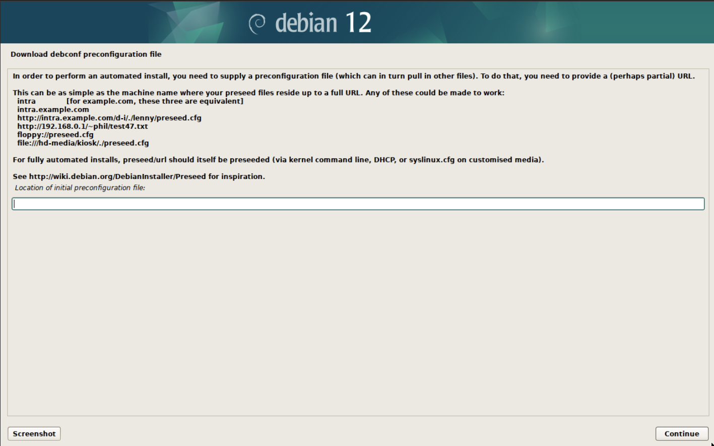
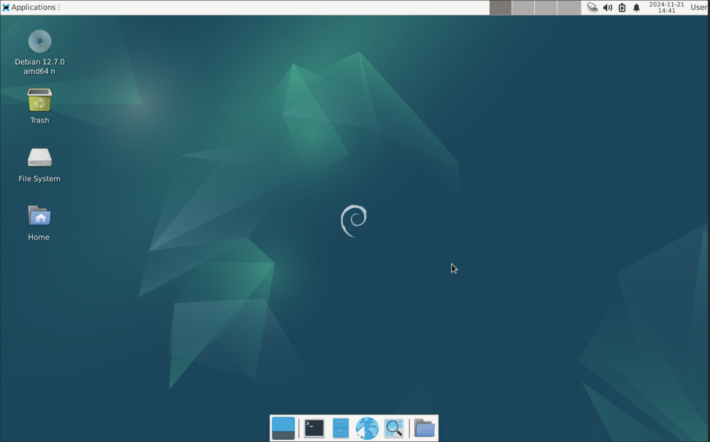
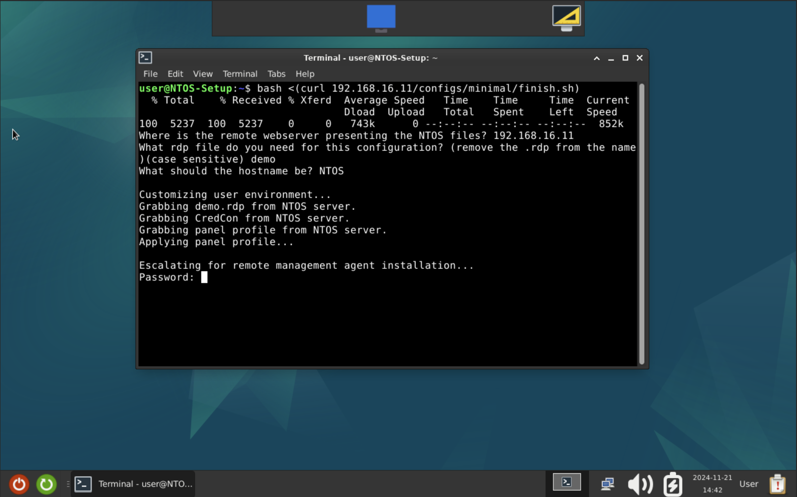
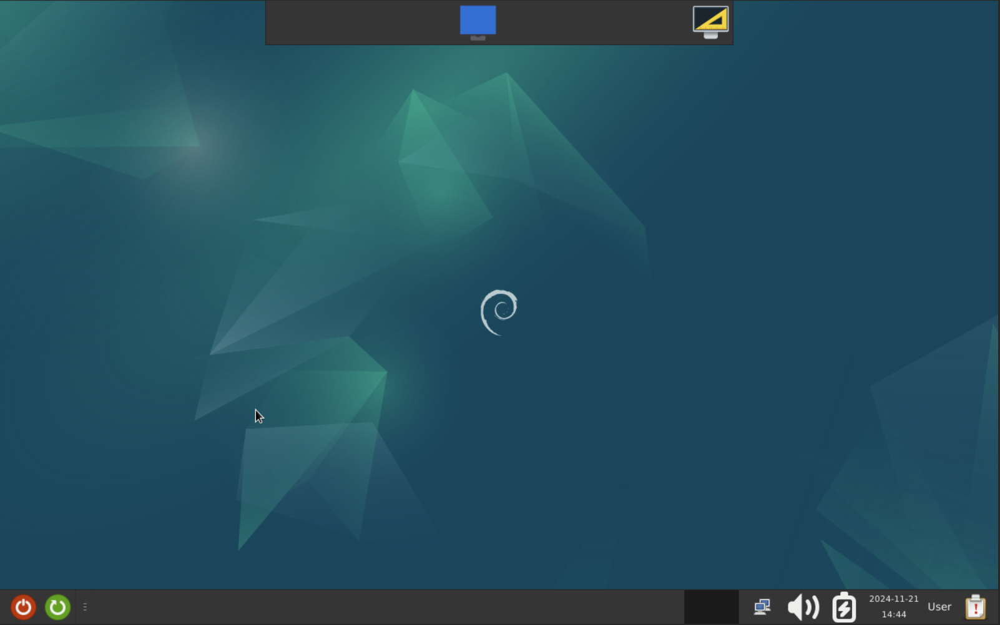
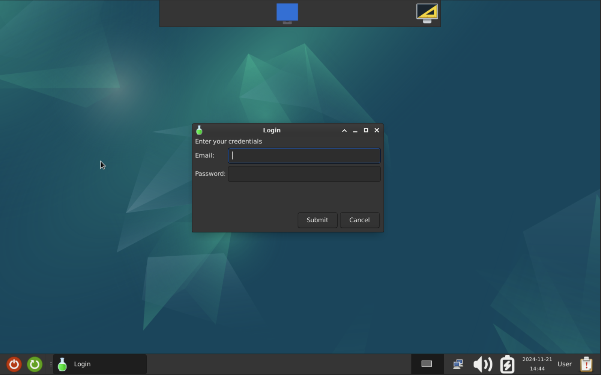

> [!NOTE]
> *If you experience issues or have suggestions, submit an issue! https://github.com/DaanSelen/ntos/issues I'll respond ASAP!*

# Glossary (README.md)

Nerthus Thin Operating System (NTOS).<br>
What is it? What problem does it solve?<br>

NTOS tries to solve the problem where enterprise-grade ThinClient operating systems cost a lot of money for relatively less features (in my opinion).<br>
This is where NTOS comes in: - it is based on Debian for stability and security - it can run on as small of a harddrive as 4GB with 2GB RAM (tested) - and it is very minimal.<br>
It (NTOS) specifically uses a Debian installation with a customized Desktop Environment (DE) to minimize the points of "trouble" a user can cause.<br>
It offers a way to connect to cloud environments (currently only RDP-based) in a easy and straight-to-the-point method using the Credcon (Bash script) 😁.<br>

I added ways to set-up a server for installation (perhaps I can add PXE in the future). And a guide to get started! Feel free to open an issue or email me.

## How to install:

The following section explains how to apply this.

### Prerequisites:
- A configured remote management system, such as MeshCentral (the installation of such a system is beyond the scope of NTOS).<br>
Such a remote management system often provides a way to install an agent. To incorporate this into the NTOS installation do:<br>
Paste your installation commands into the root part, for example: `./configs/minimal/finish.sh at line 74 to 76`.

    > If you do not configure a remote management system, then your system will be hard to debug or trouble-shoot (because of the fool-proof nature).<br>
    > Personally I've used MeshCentral which is free and works great! Link is [here](https://github.com/Ylianst/MeshCentral)

- A Debian installation medium, such as an USB-stick with Debian net(work)-inst(allation) or the CD/DVD media flashed onto it. (For flashing see: [rufus](https://rufus.ie/) / [Balena Etcher](https://www.balena.io/etcher))<br>

- Networking connectivity. (DHCP is easiest and fastest)

### How to setup a webserver with NTOS files:

1.  To set everything up, execute the `setup.sh` bash script and answer its questions.<br>
    Once that's done, you can verify that with (configure to your own situation):<br>
    `curl http://localhost/configs/minimal/preseed.cfg`.<br>
    This should output the Debian preseed for the minimal configuration.<br>

### How to install a client.

1.  To kick-off the installation, insert your USB (or other medium) into your to-be installed system.<br>
    Just like a normal Debian installation boot off of the USB-medium. Then instead of entering the (graphical) install, go to `Advanced settings -> (graphical) Automated install.`<br>
    This will load basic modules from the installation media, and load them. These include but are not limited to network connectivity (to connect to the webserver presenting NTOS-files).<br>
    
    > For an example see [preseed-screen](./assets/images/debian12-preseed-screen.png).<br>

2.  Refering to the webserver endpoints below - enter the IP-address or hostname of the webserver (with the port) followed by `/configs/<desired-config>/preseed.cfg`. By default the minimal configuration is available.<br>
    This makes the [Debian-installer](https://www.debian.org/devel/debian-installer/) use the preseed configuration for its installation.<br>
    The only manual input needed for installation is the partitioning, this is because this project has been made for a machine with 4GB total storage.<br>
    This means, if you have more than let's say 6GB total storage, then you can choose the Guided Partitioning (expert users can make something themselves).<br>

3.  Now the machine will install itself using the selected configuration from ./ntos/configs (if you selected it correctly).<br>
    Just wait a while, the older the machine the slowed it will be. Once the installation is complete the machine will restart itself as per instruction of the preseed. <br>

4. Once the machine has succesfully booted into the Desktop Environment (DE) you have chosen (the default is XFCE4) open a terminal and enter:<br>
    `bash <(curl <your-ntos-server-ip/hostname:port>/configs/<desired-config>)`<br>
    This will initiate the 'finisher'-script, after which the install should be complete.

    > For examples see the image examples or the [images-directory](./assets/images)

5. Enjoy! Linux is so much fun to use. 😉

## Image examples:







## Webserver endpoint structure:

The Bash `install.sh`-script copies the needed files to the specificied location on the system, preferably a webserver root.

The following endpoints are available by default. This is needed for the new machine to set itself up.

```shell
/assets/panel-profile.tar.bz2   # XFCE4 Panel profile.
/credcon/credcon.sh             # Bash script for asking user credentials (for the RDP connection).
/configs/minimal/preseed.cfg    # The Debian preseed file.
/configs/minimal/finish.sh      # The Bash script that applies all settings.
/rdp/<your-templates>           # Directory endpoint for premade '.rdp' files
```

The above `/rdp` endpoint requires you to place premade `.rdp` files in the directory before running `setup.sh`.<br>
Then the finish script will ask for which one to pick.

## Epilogue

I am happy I am finally able to present something I am actually very fond of, this project.<br>
I've tried to make this environment as fool-proof as possible so that non-technical people can work with this. I always appreciate feedback.<br>
Thanks<br>
